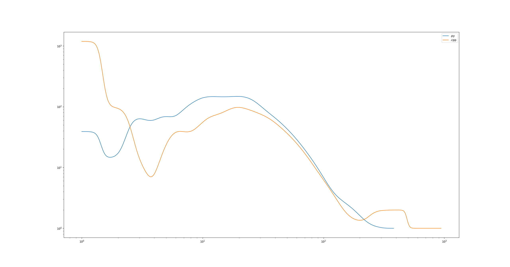

# Code Observer
This is a tool, that observes your projects and makes statistics based on the observation.

## Usage
It contains two different parts:
### Scraper:
Its task is to walk through all files in project directories and to write the results to corresponding directory
All the stuff is configured in file "project_directory_config.json", which is situated in this project\`s root.
There is an instruction for its usage into the file.
File "Observer.pyw" should be launched periodically by windows task sheuduler or something like this. 
I configured the preiod to be 15 minutes. 
In this situation the amount of data per year with my 13 observable projects is nearly 5 GB, which is OK (for me).
### Statistics:
The way to process all the logs stored during ...
There are this options as for now:
  1. Count all the size of code files in symbols / lines.
  2. Number / percent of blank lines
  3. Watch statistics of code amount with different extensoins (e.g. { ".cpp" : 420, ".py" : 42 } )
  4. Plot the graph of line length distribution.
  5. Plot the graph of line length distribution in different extensions.

Here is an example for .py and .cpp files line length distribution:

